# Open Telemetry - Spring Boot - Prometheus - Exemplar - Loki - Tempo - Grafana

## Deploy using Multipass

Download Multipass [here](https://multipass.run/)

Create Ubuntu instance on local environment:

`$ multipass launch --name demo --mem 4G --disk 10G`

Log in into the server:

```
$ multipass shell demo
$ sudo su
```

Clone the repo: 

```
$ git clone https://stazdx@github.com/stazdx/otel-springboot-grafana-tools.git
$ cd otel-springboot-grafana-tools
```

Running demo:

```
$ chmod +x run.sh
$ ./run.sh
```

Get IP and ports for `Spring Boot App` and `Grafana`


| Service | URL |
|------|------|
| Spring Boot | 192.168.64.5:8080 |
| Grafana | 192.168.64.5:32656 |

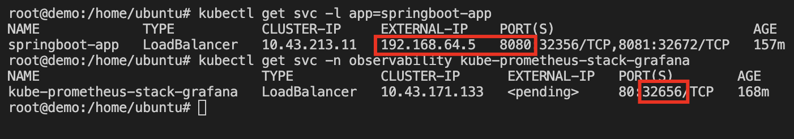

Go to the browser for testing:

For `/success` endpoint:

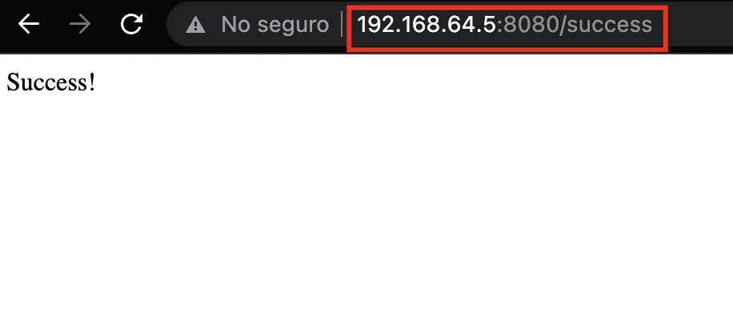

For `/fail` endpoint:

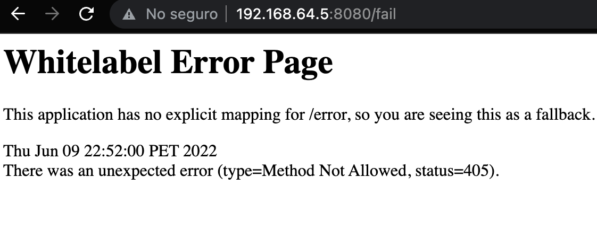
<br /><br />

### Testing Grafana: <br /><br />

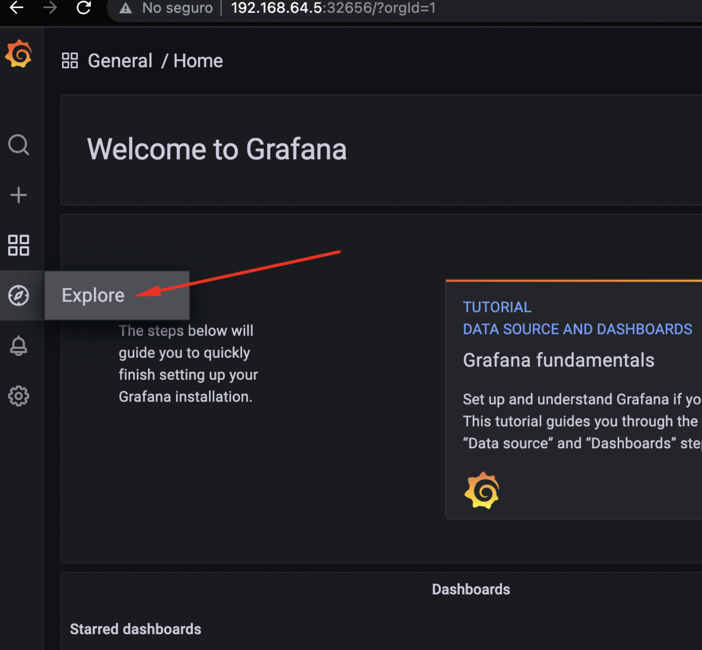 <br /> <br />
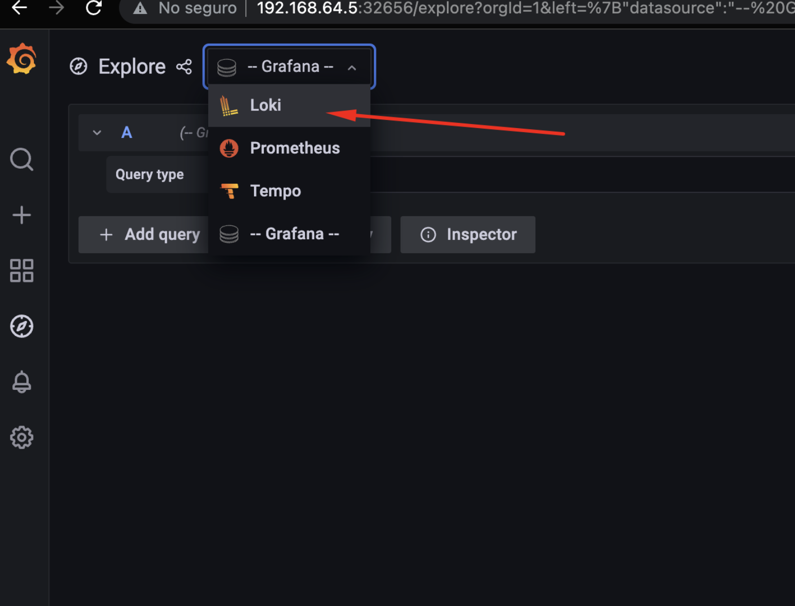 <br /> <br />
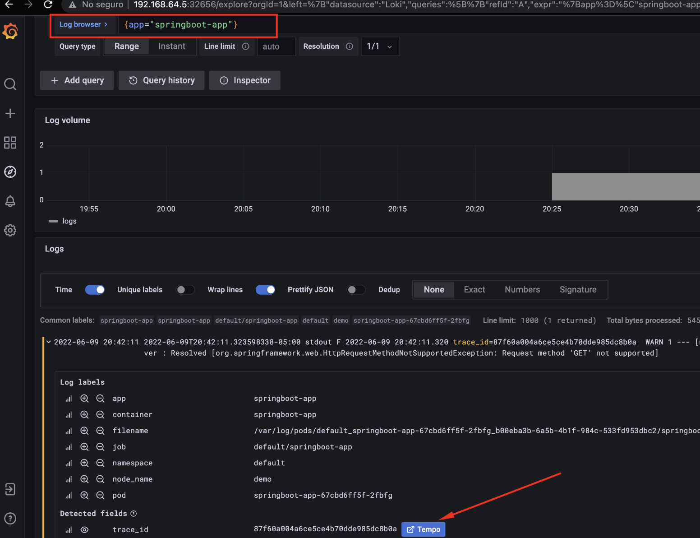 <br /> <br />
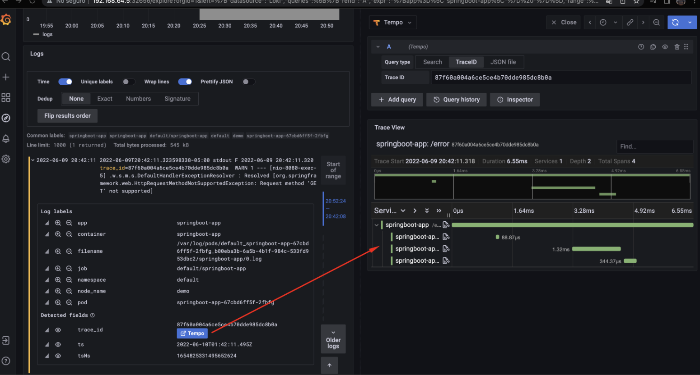 <br /> <br />
 <br /> <br />
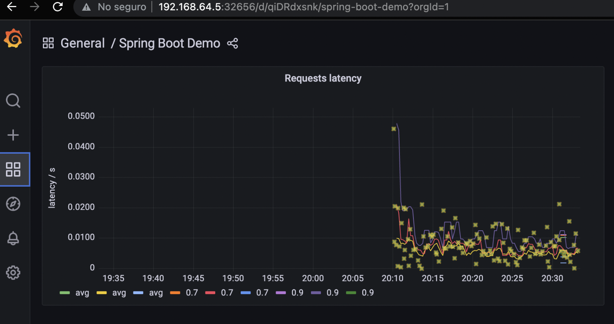 <br /> <br />
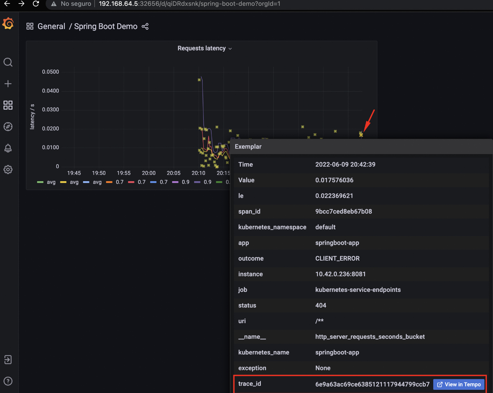 <br /> <br />
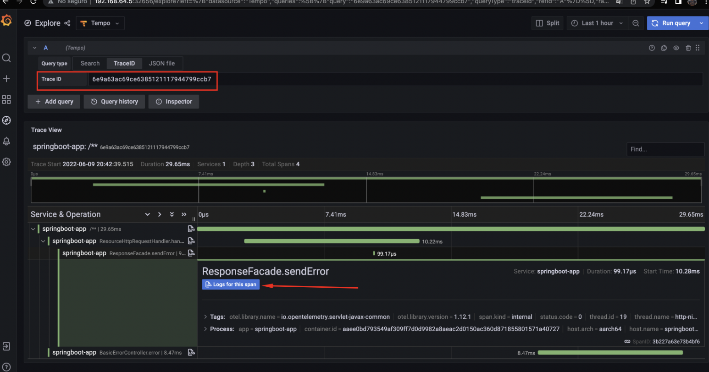 <br /> <br />
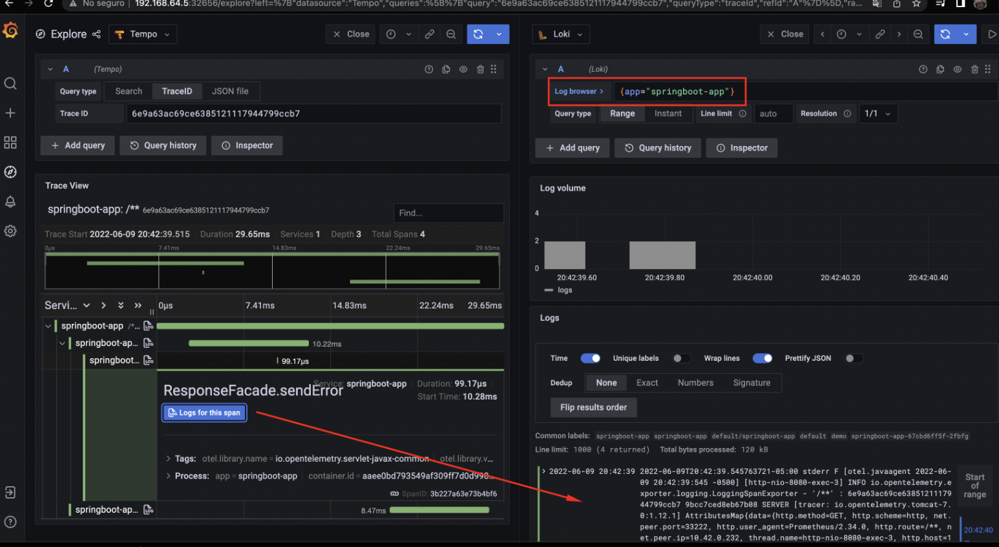
